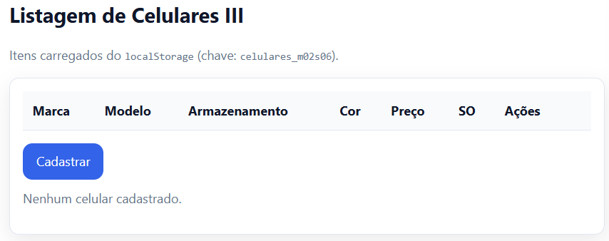

# [M02S06] Ex.: 04 – Listagem de Celulares III

Lista itens a partir do `localStorage` (chave: `celulares_m02s06`), com:
- Tabela de celulares cadastrados no **Ex. 04 – Cadastro de Celulares III**
- Coluna **Ações** com botão **Excluir** (remove da tela e do localStorage)
- Botão **Cadastrar** que redireciona para a tela de cadastro

## Como executar
1. Abra `index.html` no navegador.
2. Se já tiver cadastrado celulares (Ex. 04 – Cadastro de Celulares III), eles aparecerão na tabela.
3. Clique **Excluir** para remover um item.
4. Clique **Cadastrar** para ir à tela de cadastro.

## Resultado
